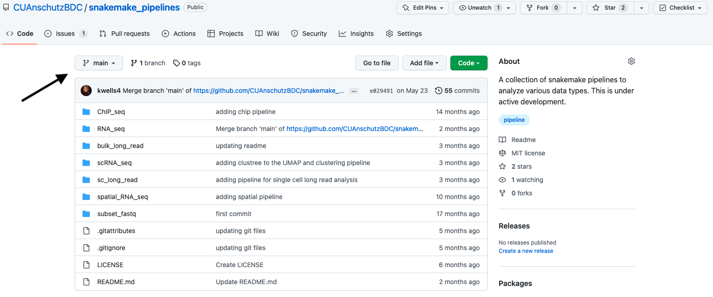
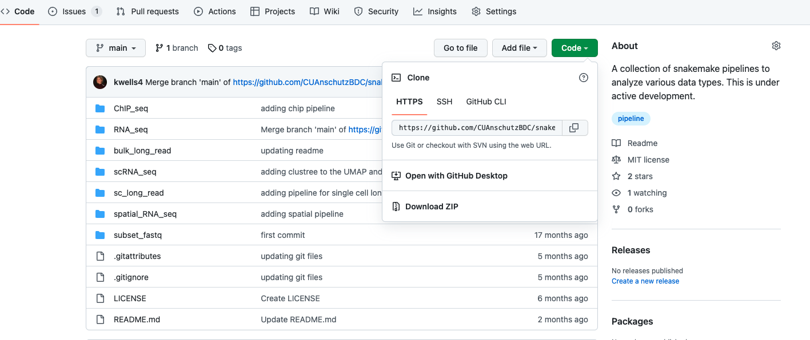
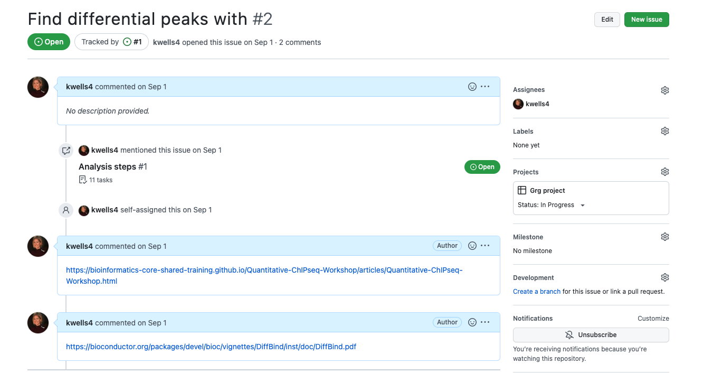
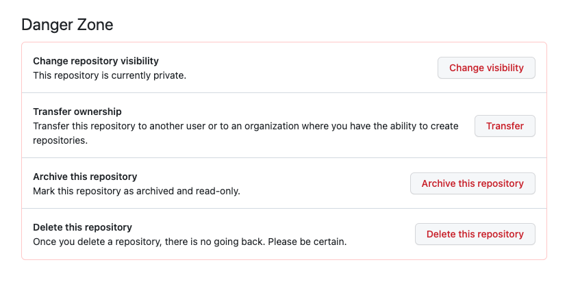

# Github tutorial

This document walks through the steps of setting up your own github account, being added to the BDC organization, exploring the resources already part of the BDC organization, and adding your own repositories.

# Quick tips

[TODO]

# Starting out
* Setting up your own github
  * To set up your own github, visit the [student github page](https://education.github.com/discount_requests/student_application). If you are a student, you should be able to get a free student account, but you do need to provide some evidence that you are a student. Feel free to come talk to me (Kristen) if you have any trouble setting up an account.

* Getting added to the BDC organization
  * Once you have an account, send your username to Kristen (kristen.wells-wrasman [at] cuanschutz [dot] edu). 

# Using the github web interface
Github has a nice web interface that is easy to use.

## Exploring the BDC organizaiton
The BDC organization has it's [own page](https://github.com/CUAnschutzBDC) with the repositories that are likely helpful to you and your work. First on the main page, you see "popular repositories". These are the repositories that have been updated the most frequently.


\
\
\

Below this you see all of the repositories that you have access to in the organization


\
\
\

You can also see all of the repositories by clicking the repositories tab.


\
\
\

We also have teams that are part of the BDC. This way you can choose to share your code with everyone at the BDC or with only your lab. All teams are part of the BDC large team.


\
\
\

To view all teams assocaited with the BDC, click the "{x} teams" button


\
\
\

Within each team, you can view the repositories. To find repositories that I think are helpful to the larger BDC community, view the BDC team by clicking "All BDC" above.


\
\
\

This page isn't very exciting at the moment, but you can click the "repositories" tab at the top to view the repositories already associated with the BDC.


\
\
\

At the moment there are three repositories.

1. `scAnalysisR`
  * An R package written by Kristen to analyze single cell analysis
2. `snakemake_pipelines`
  * Pipelines written by Kristen to analyze multiple types of data with example scripts. Including ChIP-seq, RNA-seq, scRNA-seq, long read sequencing, scRNA-seq, single cell long read sequencing, and spatial RNA-seq. These will be updated as more pipelines are created.
3. `Tutorials`
   * A collection of tutorials written by Kristen to help you navagate the current analysis. Currently, the tutorials include using the bodhi server, using `snakemake` and using github. Tutorials will be added as I see the need for them (feel free to email Kristen to ask for a tutorial!)


You can also go to your team to see all repositories available to your lab. These include the BDC repositories as well as repositories specific to your group.

## Exploring exisiting repositories
Once you feel comfortable with the overall structure of github, you can start exploring existing repositories. Let's walk through the `snakemake_pipelines` as an example. 

To find the `snakemake_pipelines` repository, click the "Repositories" tab and search snakemake_pipelines.


\
\
\

Once here, click on the repository name to start viewing the contents. You can think of these repositories as folders. In fact, they were created from a folder, or directory, on my computer.

After you click on the repository name, you will see the contents of the repository. There are a few important pieces to this screen. First, in the box there are all of the directories (or folders) and files contained in the repository.


\
\
\

There is also a place called issues. This is where people can ask questions if something isn't working. This is also where I put my to do list and issues I've been having while developing the pipeline. In analysis repositories, I also use this to take notes on what I'm observing during the analysis.


\
\
\

Where you see "main" below, these are the branches. One nice thing about github is you can make changes to a repository you are part of but not change the main repository. This means you can start developing something new but not change the actual repository until you know it is working.



\
\
\

Looking at the commits, you can see how many times the repository has been updated and what exactly was changed during each update.


\
\
\

You can also do things like download the whole repository, get a link to clone the repository into your own computer, or add files using the actions at the top.


\
\
\

If you scroll down, you see something called a `README`. This is a file that generally walks you through how to use the repository effectively. For example, in this `README` I walk you through what needs to be downloaded to run each of the different pipelines. This also generally includes how people want you to cite their work. Make sure if you use code from a github repository to include that in your paper and give appropraite credit.


\
\
\

Let's now walk through each of these locations.

First, we can click on one of the folders, `scRNA_seq`. Here you see a page that looks very similar to the first page where you again see many folders. The folders here are pretty typical of an analysis pipeline. Any files that you may need associated with the repository are in the `files`. The `src` folder has all of the code and within that you will see two new folders, `rules` and `scripts`. The `rules` is specific to `snakemake` while `scripts` are all of the external scripts needed to run the pipeline. Again, down at the bottom is a `README` with the specific instructions to run the pipeline.


\
\
\


\
\
\


\
\
\

If you click on the issues, you can see issues people have brought up. I often find this particularily helpful if I run into a problem running an existing pipeline. Remember to look through both the open (issues that haven't been addressed) and the close (issues that have been addressed) when trying to solve a problem. Another important note, feel free to open your own issue when you run into a problem running someone's code or package. All code published on github will have this issues tab, definitely use it! Before submitting an issue, make sure you understand how to use markdown formatting so that your issue is easy to read.


\
\
\

If you click the commits, you can see all of the changes that have been made to the repository.


Clicking the blue number on the right side will let you see the exact changes that were made with a specific commit. 


\
\
\

Clicking the double arrows will let you see (and download) the repository at that point in history. This is why github has version control. If you commit wisely (and often), even if you make a change that breaks something, you can easily go back in time and redownload your script before you made the error.


\
\
\

If you click the "code" button, you see options for downloading the repository. You can either download a zip of the whole directory by clicking "download zip" or you can clone the repository by copying the link and then typing

```bash
git clone {link_you_copied}
````

In your desired location on your computer. This will link to the repository directly so you can actually make changes to it and upload your changes to github.



\
\
\


If you do clone the repository, you will be able to see the entire folder structure on your computer.


*Note you won't see two files here `.gitignore` and `.gitattributes`. This is because they are hidden files. They do exist on your computer, you just can't see them. You can view them with `ls -a` in your terminal.*

## Looking at repositories outside of the BDC

Check out some other fun repositories

* [color palettes](https://github.com/BlakeRMills/MetBrewer) - fun color pallettes and nice use of readme
* [Seurat](https://github.com/satijalab/seurat) - A single cell analysis package with a lot of users. There are many open and closed issues her to explore and thousands of commits that you can see. This is also a good example or multiple people working collaboratively on a project and responding to issues with commits (when you change your code in response to an issue, you can link to that change directly in the issue).
* [ggplot](https://github.com/tidyverse/ggplot2) - Another good repo showing best practices of using github collaboratively with a package you've probably used before.


# Linking your directories to github

## Creating a repository in github
Once you are part of the BDC, you can create a repository in two places

1. Your own github account
2. The BDC account

To create a repository in your own account, first navagate to github. Click the upper right hand corner (where there is a picture of you or a circular image) and click "your profile" to get to your main page.


\
\
\

Your home page will look something like below. There will be information about you. You can also pin repositories that you want others to easily see. As you can see on mine, you can pin repositories from the BDC organization. There is also a link to all of your repositories and a graph showing your contribution history from the last year. I'd recommend you set this contribution history so it also shows contributions to private repositories. Many hiring teams will look at your github during the hiring process if you are applying for a bioinformatic position so it's best to keep this up to date.


\
\
\

To create a new repository, click the repositories link on the top of the page. This will show all of your existing repositories. Next, click the green "New" button


\
\
\

Once you've clicked this, you will see a form appear. First, you get to decide where you want the repository under the "Owner" option. You will likely have two possible locations, your own account or the BDC account


\
\
\

If you select your own account, you are the only person who will have access to this repository until you add other github members or make the repository public. If you select the BDC account, you can easily share the repository with your lab or any members of the BDC. Don't stress about this decision too much, it's very easy to transfer repositories between your personal account and the BDC account.

Once you selected the accound, you'll need to come up with a name of your repository. Make sure it's something that makes sense to you - maybe a short description of your project. For example scRNA-seq-ins-cre. Then you'll need to write a short description of the project. This is just one or two sentence describing what is in the repository. When I eventually publish the paper, I also will provide the name of the publication here. Next you can decide if the repository should be public or private. I always keep repositories associated with papers private until the paper is published. You can always switch from public to private. If you have a free student account, you will have unlimited free private repositories. Next you can decide if you want some documents already added into the repository for you. I generally opt not to do this because I want to add a folder that's already been created on my compute to the repository. If you are starting from scratch though, feel free to add the README, .gitignore, and license.

Once you've filled in all the requred information, click "Create repository".


\
\
\

Once you create the repository, you will see a page with instructions for how to proceed. You can just go to your exiting folder on your computer that you want to upload and follow the commands shown on this page. Let's do this with a quick test directory.

```bash
mkdir test_dir
cd test_dir
echo "this is a test\n" > test_file_one.txt
echo "another test\n" > test_file_two.txt
echo "# First repository\n\nThis is my first repository\n" > README.md
git init
```

```
Initialized empty Git repository in /Users/wellskr/Documents/Analysis/test_dir/.git/
```

This sets up the git repository. Now you can check the status of all of your files

```bash
git status
```

```
On branch master

No commits yet

Untracked files:
  (use "git add <file>..." to include in what will be committed)
	README.md
	test_file_one.txt
	test_file_two.txt

nothing added to commit but untracked files present (use "git add" to track)
```

This says that you are on the branch called "master" and you have three files and no commits. It tells you how to add files. To add all untracked files type `git add .`

```bash
git add .
git status
```

```
On branch master

No commits yet

Changes to be committed:
  (use "git rm --cached <file>..." to unstage)
	new file:   README.md
	new file:   test_file_one.txt
	new file:   test_file_two.txt
```

Now these files are ready to be commited

```bash
git commit -m "first commit"
```

```
[master (root-commit) 8f8563e] first commit
 3 files changed, 8 insertions(+)
 create mode 100644 README.md
 create mode 100644 test_file_one.txt
 create mode 100644 test_file_two.txt
```

Here after the `-m` you want a brief description of what you did. For example, if you just changed some plotting parameters in your UMAP plots you would say `git commit -m "updating UMAP plots"`

Now follow the steps outlined on the webpage

```bash
git remote add origin https://github.com/kwells4/test.git
git branch -M main
git push -u origin main
```

This now tells github what the URL is that you want to link to. It then switches the name of the main branch from master to main (the current best practice) and finally, your changes have been pushed to github.

If you created the repository in the BDC organization, you can now decide if you want to share the repository with anyone else. A link to do this will appear at the top of the repository.


\
\
\

Clicking this link you will see a page to control individuals or teams that can see the repository. You can either add just your lab or the whole BDC. Again, this is easy to update at any time.


\
\
\

### Keep the repository updated
Now that you have your repository built either in your account or the BDC account, it's important to maintain it.


#### Add `.gitignore`
I like to maintain my github repos with my most up to date scripts, but not the bulk of my analysis

**IMPORTANT DON'T UPLOAD LARGE FILES TO GITHUB, IT WILL CAUSE PROBLEMS DOWN THE ROAD. IT'S ALWAYS A GOOD IDEA TO TRY `git status` AND MAKING SURE THAT YOU ARE ONLY ADDING FILES THAT YOU WANT BEFORE COMMITTING. IF YOU DO COMMIT A LARGE FILE, FOLLOW THE STEPS BELOW TO REVERSE THE COMMIT WITH THE LARGE FILE**

To make sure that only scripts are being uploaded and no large data files, I like to use a special hidden file called a `gitignore` file. It is a hidden file because the name of the file is `.gitignore`. You can see these hidden files in any folder using the `ls -a` command.

The `.gitignore` file specifies to github what files you don't want tracked in your repository. This uses pattern matching, so you don't need to add all files.

My `.gitignore` file always starts the same way

```
.*
!.gitignore
!.gitattributes
```

Here the `.*` means to ignore all hidden files and directories. The `!` means negate a previously igored pattern in some way, so `!.gitignore` means "even though you are ignoring hidden files, don't ignore the `.gitignore` file." The `!.gitattributes` means the same thing but with a `.gitattributes` file. 

Let's say you have a directory that looks like the one below


\
\
\

Here, if we had a `.gitignore` file like above and say `git status` only `.gitignore` and `.gitattributes` are in line to be added, not `.DS_store`


\
\
\

The `.gitignore` can also ignore any file type using pattern matching. For example, let's say you don't want your html of markdowns, you would add `*.html` to your `.gitignore`. This means that even if the html file is in a subdirectory, it will still be ignored by `git add .`

So now our `.gitignore` looks like

```
.*
!.gitignore
!.gitattributes
*.html
```

But let's say that we don't want to include any of the results. It has large images and tables and is not useful for reproducing any of the analysis. I like to keep all of my results in a directory called results (more on my organizational strategy in a bit), but having all of your results in one place makes it easy to ignore with `results` added to your `.gitignore`

So now I've made a results folder and added some things to it:


\
\
\

If we run `git status` you can see that the results folder is a tracked change that is not staged.


\
\
\

But we don't want the results to be added, so we update our `.gitignore` as follows

```
.*
!.gitignore
!.gitattributes
*.html
results
```

And run `git status` again.

\
\
\

Notice that now, the results are no longer tracked so any changes to this folder will not be added to github.

You can add a lot of complexity to the `.gitignore` to track only specific files, but I leave that fun up to you!

#### Add `.gitattributes`

*Note: many people don't add a `.gitattributes`. I like to because it makes my github feel more clean and accurate.*

The `.gitattributes` file is a bit more simple than the `.gitignore` file. When you are looking at a repository on github, it always tells you what percentage of their code is different languages. They have a pretty good system that makes this work, but I have a few cases that they don't capture quite right for the bulk of my analysis, so I have to tell github how I want those files tracked.

My `.gitattributes` looks like:

```
*.html linguist-generated
*.Rmd linguist-detectable
*.rmd linguist-detectable
*.ipynb linguist-generated
*.snake linguist-language=Python
```

Let's walk though these step by step

* `*.htlm linguist-generated` - What this is saying is that anything that has a `.html` is not something I wrote, it was generated (generally by using r markdown). The html files made by r markdown are huge and any repository containing these will be 99% html. I don't write html and don't want anyone to think my mostly R and python repositories are html so I change this to `linguist-generated`
* `*.RMD linguist-detectable`/`*.rmd linguist-detectable` - By default, github does not consider Rmarkdown files as R because they can have a lot of text, but they also have a lot of R code, so I tell github to count it.
* `*.ipynb linguist-generated` - Same as `.rmd` but for python notebooks
* `*.snake linguist-language=Python` - Snakefiles and snake rules are all python (snakemake is a python based language) so I like to make it so github can detect and count those files.

#### Keep everything up to date
There are several things I keep in mind while keeping everything up to date

* Push new updates regularily! I generally do at least 1 push daily that I work on a project. I'll do more if what I'm doing can be broken into sections. For example, I wrote a new function or I added a new script, or I added a new section to a script. The better you are at keeping frequent pushes, the easier it will be to go back to a previous state of your analysis. If you have too many changes in one commit, you will need to weed through your commit to find the correct code.
* If you have the repository in other places, remember to pull before you push. You won't be able to commit new changes if it is different than your other branch
  * I do this to keep all of my code on the server and my local machine in sync
  * Pull using: `git pull --no-rebase origin main`
* Keep notes of conclusions you make along the way. Remember you can do this using the issues associated with your repo. This means that all of your analysis and thinking will be in one place! You can also then link a specific commit to your issue so you can always find what changes you made that led you to a certain conclusion.

### Other ways to use GitHub

* In addition to keeping all of your code in one place, GitHub is a great place to keep your (computational) project organized. 

#### Use issues to track your progress

One great tool is to use issues. You can get to issues through the "issues" tab in a repository. Below is an image of my "issues" as part of my bulk ATAC-seq pipeline. This is a pipeline where I'm developing my own analysis through bulk ATAC-seq. This is my first time doing this analysis so I have lots of notes.


\
\
\

You can see here that I have many issues posted. Some are tasks, like "Analysis steps" and "Use chipseeker to annotate regions". Some are notes, like "Papers of interest".

If you click on the analysis steps, you can see that I've taken each step and made it into an issue. This is because each of the steps are large and have a lot of information for me to think about.

\
\
\

If we look at one of these sub-issues, you can see that I've added links to tutorials that show how other people approached the question. This is a good way for me to always be able to find a tutorial, even months later.

\
\
\

You can also link to specific commits (changes in code) like below. If that commit included code that fixed the issue or finished the item on the to do list, you can close the issue and note what specific update was used to finish the task.

\
\
\

#### Use projects to keep track of many repositories

Once you have a few repositories associated with your project, you can start organizing them in GitHub projects. This is a way to link issues from multiple repositories. You can also see what is done, what is in progress, and what you have yet to start.

\
\
\

One aspect of projects that's especially helpful is that you can easily collaborate. For example, let's say one person in your lab is looking at ChIP-seq and ATAC-seq of a protein of interest while another person is doing RNA-seq on a KO of that same protein. You can have a joint project where you can both see what the other person is actively working on. You can also add me to your projects and we can have issues that I'm trying to solve (like why you are getting a specific error or how to do some aspect of the analysis) while also keeping track of your own progress. Above I have an example of a project where I stareted with some single cell RNA-seq. We later added bulk ATAC-seq (that I wanted to keep in it's own repository). But I could link the two repositories and remember where I am in both sides of the analysis easily using the project.

## General structure of directories

I find that it is very helpful to have a consistent structure in all of my directories and repositories. This way, even if someone is asking a question about a project that I haven't thought about in 6 months, I always know where I should be looking.

I will walk you through my structure below, but make sure that you use a structure that makes sense to you.

First level of repository:
```
src
files
README
license
.gitignore
.gitattributes
```

* `src` - This is where you can find my code. It is very common to see a `src` directory in a repository. When you see this, you know to look for specific scripts in this directory.
* `files` - This is any files that are important to analysis. For example, gene lists from collaborators that I use
* `README` - Described above. This should be a markdown file that walks people through the purpose of your repository and how to use it to replicate your analysis.
* `license` - The license that tells other people how to use your repository. I like the MIT license. You can create this by clicking the "Add file" button at the top of the main page for the repository. If you type in "license" it will come up with a menu for pre-writen licenses.
* `.gitignore` - Described above
* `.gitattributes` - Described above

On my local machine, this repository will also contain a `results` directory that I will ignore using the `.gitignore` file.

If you click on the `src` directory, you will see

```
scripts
rules
```

* `scripts` - Contains all of my scripts
* `rules` - Contains any rules associated with snakemake

You could also structure this so each language gets a direcotry.

## Command line tools

We've gone through a lot of ways to use GitHub. Below is a quick reference guide to the most commonly used commands

Initialize a new repository. In linux move to the direcotory that you want connected with GitHub and run:
```bash
git init
````

See what files will be added (remember to add any files that you don't want on the server, especially large files, to your `.gitignore`:
```bash
git status
```

After making sure that the files present you want added, stage them for commit with
```bash
git add .
```

Or add specific files
```bash
git add path/to/one/file
```

*Note after adding, be sure to look through the files again to make sure you are not pushing a large file or a file that you don't want on github*

Commit the changes
```bash
git commit -m "some message that explains your changes"
```

Connect your repository with an empty repo you created on GitHub
```bash
git remote add origin https://github.com/path/to/repo
git branch -M main
```

Push changes to the remote repo
```bash
git push -u origin main
```

Pull any changes from the remote repo
```bash
git pull --no-rebase origin main
```

## Moving repositories between the BDC and personal accounts
To move a repository, first visit the GitHub website and go to your repository page. On the top menu, click the "Settings" tab. Scroll all the way to the bottom and click "transfer ownership"

\
\
\


In the window that pops up, type in `CUAnschutzBDC` to transfer the repository to the BDC.

\
\
\

Type in the path to the repo and click "I understand, transfer this repository".

You can now change the settings to make it visible to your lab or the entire BDC.

Once you have moved your repository on GitHub, you need to change the URLs associated with the linked directories on your local machine and the server

You can find the new URL by clicking the Code button on your repository and copying the link.
```bash
git remote set-url origin {URL}
```

## Errors and common problems
* If you accidentally commited something large
  1. Don't try to fix it by removing that thing and commiting again!
  2. Don't push it!
  3. Just do `git reset HEAD~`, update your `.gitignore` and add again.

* If you have made changes elsewhere and forget to pull before pushing, you will get an error

```
To https://github.com/CUAnschutzBDC/Grg_bulk_atac.git
! [rejected]        main -> main (fetch first)
error: failed to push some refs to 'https://github.com/CUAnschutzBDC/Grg_bulk_atac.git'
hint: Updates were rejected because the remote contains work that you do
hint: not have locally. This is usually caused by another repository pushing
hint: to the same ref. You may want to first integrate the remote changes
hint: (e.g., 'git pull ...') before pushing again.
hint: See the 'Note about fast-forwards' in 'git push --help' for details.
```

  1. Pull from the remote `git pull --no-rebase origin main`
```
Changes not staged for commit:
Merge branch 'main' of https://github.com/CUAnschutzBDC/Grg_bulk_atac into main
# Please enter a commit message to explain why this merge is necessary,
# especially if it merges an updated upstream into a topic branch.
#
# Lines starting with '#' will be ignored, and an empty message aborts
# the commit.
```
  2. Change the message as you need
  3. Press `:` followed by `w` + `q` to exit
  4. Push again `git push -u origin main`

* If you have made changes elsewhere and there are clashes
  1. Pull from the remote as above
  2. Github will link the files that have been changed in two locations. These files will have both versions and each version will have lines that mark what file it came from
  3. Manually fix these files to be correct
  4. Commit the changes


I'm sure there are many problems I'm missing. If you have a problem that you are struggling to solve, come talk to Kristen and we can work it out together.
